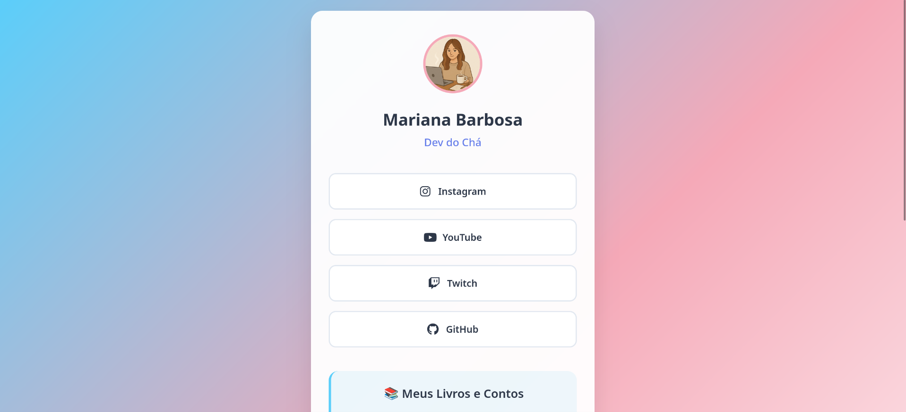
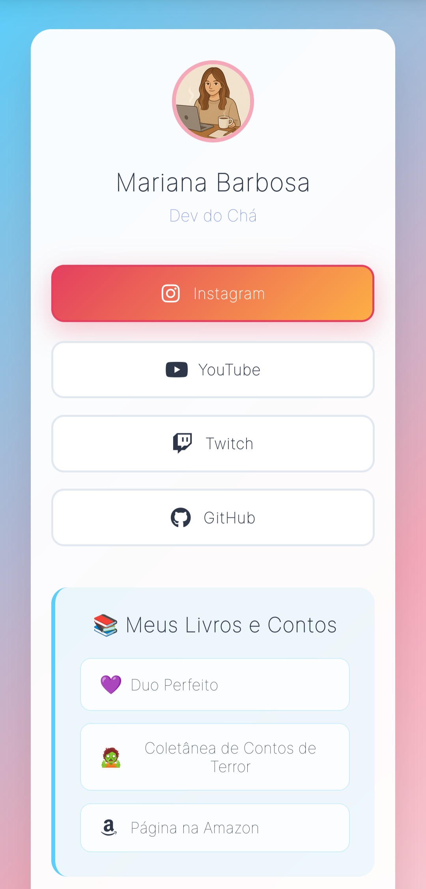

# 🏳️‍⚧️ Link in Bio - Mariana Barbosa

[](https://developer.mozilla.org/en-US/docs/Web/HTML)
[](https://developer.mozilla.org/en-US/docs/Web/CSS)
[](https://fontawesome.com/)
[](https://opensource.org/licenses/MIT)

> Uma página link-in-bio moderna e inclusiva com design inspirado no Linktree e cores da bandeira trans.

## ✨ Sobre o Projeto

Este projeto é uma página pessoal estilo "link in bio" desenvolvida com HTML5 e CSS3 puro, apresentando um design moderno e responsivo com as cores da bandeira transgênero. A página centraliza todos os links importantes da Mariana Barbosa, incluindo redes sociais, livros e formas de apoio.

### 🎯 Características Principais

- 🏳️‍⚧️ **Design Inclusivo**: Cores da bandeira trans (azul claro, rosa e branco)
- 📱 **Totalmente Responsivo**: Funciona perfeitamente em dispositivos móveis e desktop
- 🎨 **Animações Suaves**: Transições e efeitos hover modernos
- 🌙 **Modo Escuro**: Detecção automática de preferência do sistema
- ⚡ **Performance**: Carregamento rápido e otimizado
- 🔗 **Ícones Oficiais**: Font Awesome com ícones das marcas originais

## 🚀 Demo

[🔗 Ver Demo ao Vivo](https://devdocha.github.io/link-in-bio)

## 📸 Screenshots

### Desktop


### Mobile


## 🛠️ Tecnologias Utilizadas

- **HTML5**: Estrutura semântica e acessível
- **CSS3**: Estilização moderna com Flexbox e animações
- **JavaScript**: Funcionalidade de copiar PIX e interatividade
- **Font Awesome 6.4.0**: Ícones oficiais das redes sociais
- **Google Fonts**: Fonte Inter para tipografia moderna

## 📂 Estrutura do Projeto

```
link-in-bio/
│
├── index.html              # Página principal
├── style.css              # Estilos CSS
├── script.js              # JavaScript para funcionalidades
├── README.md              # Documentação
├── LINKS-GUIDE.md         # Guia para substituir links
├── LICENSE                # Licença MIT
└── assets/
    ├── Perfil.png         # Foto de perfil
    ├── screenshot-desktop.png
    └── screenshot-mobile.png
```

## 🎨 Paleta de Cores

 Hex | Uso |
-----|-----|
#5BCEFA | Azul Trans - Gradiente principal |
#F5A9B8 | Rosa Trans - Acentos e bordas |
#FFFFFF | Branco - Gradiente e cards |
#2d3748 | Cinza Escuro - Texto principal |

## 🚀 Como Usar

### 1. Clone o repositório
```bash
git clone https://github.com/seu-usuario/link-in-bio.git
cd link-in-bio
```

### 2. Personalize o conteúdo
- Substitua `assets/Perfil.png` pela sua foto
- Edite `index.html` para adicionar seus links reais
- Modifique as informações pessoais

### 3. Abra no navegador
```bash
# Abra o arquivo index.html no seu navegador
open index.html
```

## ⚙️ Personalização

### Alterando Links
Edite o arquivo `index.html` e substitua os links `href="#"` pelos seus links reais:

```html
<a href="https://instagram.com/seu-usuario" class="link-button">
    <i class="fab fa-instagram link-icon"></i>
    Instagram
</a>
```

### Modificando Cores
No arquivo `style.css`, você pode alterar o gradiente de fundo:

```css
body {
    background: linear-gradient(135deg, #5BCEFA 0%, #F5A9B8 50%, #FFFFFF 100%);
}
```

### Adicionando Novas Redes Sociais
1. Adicione o HTML no `index.html`:
```html
<div class="link-item">
    <a href="#" class="link-button">
        <i class="fab fa-linkedin link-icon"></i>
        LinkedIn
    </a>
</div>
```

2. Adicione o estilo específico no `style.css`:
```css
.link-button:has(.fa-linkedin):hover {
    background: linear-gradient(135deg, #0077B5, #00A0DC);
    border-color: #0077B5;
    box-shadow: 0 8px 25px rgba(0, 119, 181, 0.3);
}
```

### Personalizando o PIX
Para alterar a chave PIX, edite em dois lugares:

1. **No código copiável** (`index.html`):
```html
<code class="pix-code">sua-chave@exemplo.com</code>
```

2. **No tooltip do PicPay** (se ainda houver):
```html
title="PIX: sua-chave@exemplo.com"
```

### Adicionando Novos Livros
Cada livro pode ter sua cor específica no hover. Para adicionar:

1. **Adicione o HTML**:
```html
<a href="#" class="book-link">
    <span class="book-icon">📘</span>
    Novo Livro
</a>
```

2. **Adicione a cor específica**:
```css
.book-link:has(.book-icon):nth-child(4):hover {
    background: linear-gradient(135deg, #10B981, #34D399);
    color: white;
    box-shadow: 0 4px 15px rgba(16, 185, 129, 0.3);
}
```

## 🎯 Funcionalidades

### 📱 Seções Incluídas
- **Perfil**: Foto, nome e bio
- **Redes Sociais**: Instagram, YouTube, Twitch, GitHub
- **Livros e Contos**: Links para publicações com cores temáticas
- **Playlist**: K-pop para Programar (YouTube Music)
- **Apoio**: PIX com funcionalidade de copiar
- **Footer**: Assinatura personalizada

### 🎨 Efeitos Visuais
- Animação de entrada suave (fadeInUp)
- Efeitos hover únicos para cada rede social
- Cores específicas para cada livro (roxo para "Duo Perfeito", azul escuro para "Terror")
- Seção playlist com tema YouTube (vermelho)
- Funcionalidade de copiar PIX com feedback visual
- Efeito shimmer nos botões
- Transformações 3D sutis
- Backdrop filter com blur

### ⚡ Funcionalidades JavaScript
- **Copiar PIX**: Clique no código ou botão para copiar automaticamente
- **Feedback Visual**: Botão muda para "✅ Copiado!" por 2 segundos
- **Fallback**: Alert para navegadores sem clipboard API
- **Event Listeners**: Carregamento seguro após DOM pronto
- **Error Handling**: Tratamento de erros robusto

## 📱 Responsividade

O design é totalmente responsivo com breakpoints para:
- **Desktop**: 1200px+
- **Tablet**: 768px - 1199px
- **Mobile Large**: 520px - 767px
- **Mobile Small**: < 520px

## ♿ Acessibilidade

O projeto foi desenvolvido com foco em acessibilidade:

### 🎯 Recursos de Acessibilidade
- **HTML Semântico**: Uso correto de `<header>`, `<main>`, `<section>`, `<footer>`
- **Alt Text**: Todas as imagens possuem texto alternativo
- **Screen Reader**: Classe `.sr-only` para informações importantes invisíveis
- **Foco no Teclado**: Todos os elementos interativos são acessíveis via teclado
- **Contraste**: Cores com contraste adequado para leitura
- **Target Size**: Botões com tamanho mínimo de 44px para touch

### 🔧 Exemplo de Implementação
```html
<!-- Título invisível para screen readers -->
<h2 class="sr-only">Redes Sociais</h2>

<!-- Alt text descritivo -->


<!-- Estrutura semântica -->
<section class="books-section">
    <h3>📚 Meus Livros e Contos</h3>
</section>
```

## 🌙 Modo Escuro

O projeto inclui suporte automático ao modo escuro baseado na preferência do sistema:

```css
@media (prefers-color-scheme: dark) {
    /* Estilos para modo escuro */
}
```

## � Performance e Otimização

### ⚡ Otimizações Implementadas
- **CSS Puro**: Sem frameworks pesados, CSS otimizado
- **JavaScript Mínimo**: Apenas funcionalidades essenciais
- **Font Awesome CDN**: Carregamento rápido de ícones
- **Imagens Otimizadas**: Formato e tamanho adequados
- **Defer Script**: JavaScript carregado após o DOM
- **Backdrop Filter**: Efeitos visuais com performance

### 📊 Métricas
- **Primeiro Carregamento**: < 2 segundos
- **Tamanho Total**: < 1MB (sem imagens)
- **CSS**: Modular e reutilizável
- **JavaScript**: < 1KB minificado

### 🔧 Exemplo de Carregamento Otimizado
```html
<!-- CSS crítico inline ou externo -->
<link rel="stylesheet" href="style.css">

<!-- JavaScript com defer -->
<script src="script.js" defer></script>

<!-- Font Awesome via CDN otimizado -->
<link rel="stylesheet" href="https://cdnjs.cloudflare.com/ajax/libs/font-awesome/6.4.0/css/all.min.css">
```

## �💳 Sistema PIX

O projeto inclui um sistema completo para doações via PIX:

### 🔧 Funcionalidades PIX
- **Chave visível**: `marimbbarbosa93@gmail.com`
- **Copiar com um clique**: Botão dedicado para copiar
- **Feedback visual**: Confirmação quando copiado
- **Design integrado**: Cores que combinam com o tema trans
- **Responsivo**: Funciona perfeitamente em mobile

### 🎨 Interface PIX
```html
<div class="pix-section">
    <h4>💳 PIX</h4>
    <div class="pix-info">
        <span class="pix-label">Chave PIX:</span>
        <code class="pix-code">marimbbarbosa93@gmail.com</code>
        <button class="copy-btn">📋 Copiar</button>
    </div>
</div>
```

## 🤝 Contribuição

Contribuições são sempre bem-vindas! Para contribuir:

1. Fork o projeto
2. Crie uma branch para sua feature (`git checkout -b feature/AmazingFeature`)
3. Commit suas mudanças (`git commit -m 'Add some AmazingFeature'`)
4. Push para a branch (`git push origin feature/AmazingFeature`)
5. Abra um Pull Request

## 📝 Licença

Este projeto está sob a licença MIT. Veja o arquivo [LICENSE](LICENSE) para mais detalhes.

## 👩‍💻 Autora

**Mariana Barbosa** - *Dev do Chá*

- 📸 Instagram: [@devdocha](https://instagram.com/devdocha)
- 👩‍💻 GitHub: [@devdocha](https://github.com/devdocha)
- 🎥 YouTube: [@devdocha](https://youtube.com/@devdocha)
- 🎮 Twitch: [devdocha](https://twitch.tv/devdocha)

## 🙏 Agradecimentos

- [Font Awesome](https://fontawesome.com/) pelos ícones incríveis
- [Google Fonts](https://fonts.google.com/) pela fonte Inter
- Comunidade trans por inspirar o design inclusivo
- [Linktree](https://linktr.ee/) pela inspiração do layout

## 📊 Status do Projeto


---

<div align="center">
  <p>💜 Desenvolvido com amor por Mari Barbosa 💜</p>
  <p>Se este projeto te ajudou, considere dar uma ⭐!</p>
</div>
